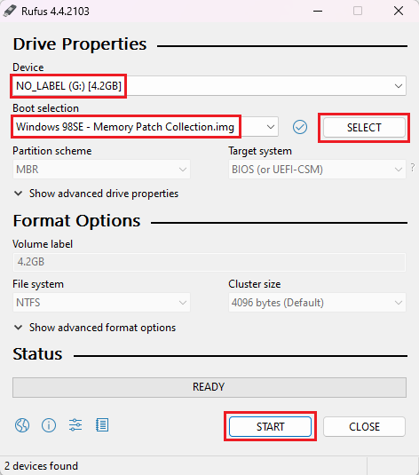

# Windows 98SE on a 2005 PC

## TLDR
Disable `Plug and Play` in the BIOS and the Windows setup, and Windows 98SE will install with USB working.

## About
This is a summary of how I installed Windows 98SE on a `HP Pavilion T3000` PC, taking into account that it has more than 512MB of RAM.

But you can do the installation differently in many ways like using a stock Windows 98SE CD for instance, just having 512MB or less of RAM installed etc.

`Plug and Play` had to be disabled both in the BIOS and the Windows setup, otherwise USB didn't work in Windows if Windows even installed at all.

This will probably work on many other more modern Windows XP etc PCs, just replace the drivers to install with the ones for your PC.

## Specifications
These are the specifications of the PC, but it's not original stock (RAM and HDD).

| What | Value | 
| --- | --- |
| Model | HP Pavilion T3000 |
| Year | 2005 |
| Original OS | Windows XP |
| CPU | AMD Sempron 3200+ |
| RAM | 1.5GB |
| HDD | 500GB |
| Video | ATI Radeon Xpress 200 |
| Audio | Realtek AC'97 |
| Ethernet | Realtek RTL8139 |

## Guide

### BIOS settings
Disable `Plug and Play OS` in the BIOS.
 `F1 (BIOS)` -> `Plug and Play OS` -> `No`
 
 

### Install Windows 98SE
1. Download the Windows 98SE USB Image: <a href="https://archive.org/download/Windows_98SE_Memory_Patch/Windows%2098SE%20-%20Memory%20Patch%20Collection.IMG.zip">Windows 98SE - Memory Patch Collection.img</a>
  You can download the <a href="https://winworldpc.com/product/windows-98/98-second-edition">original ISO</a> from WinWorld. But then you need to manually run `fdisk` and `/WIN98/setup.exe /p i` from the CD's DOS.
 In my case, the CD-ROM doesn't work properly, so using the USB image above also bypasses this issue.

2. Write the image to a USB stick with <a href="https://rufus.ie/">Rufus</a>, and insert it into the HP pc.
 

3. Boot the PC and press `ESC` to show the boot select menu, and select the `USB stick`.
 
 

4. You should now see this menu after booting from the USB stick.
 

5. Select option `7. Partition with fdisk` to partition the HDD (if necessary).
	- Select `5. Change the current fixed disk drive`
	- Enter `2`  and press Enter to choose the internal HDD.  Disk 1 = `C:` and the USB stick you booted from  Disk 2 = Internal HDD
	- Select `3. Delete partition or Logical DOS Drive` and delete all existing partitions. 
	- Select `1. Create DOS parition or Logical DOS Drive`
	- Select `1. Create Primary DOS Partition`.  If you want to dualboot with Windows XP for instance, specify a parition size.
	- Select `2. Set active partition`
	- Enter `1` and press Enter to make `D:` partition 1 `Active`.
	- Reboot the PC, and boot the USB stick once again.

6. Select option `2. Setup: 512MB Max RAM Limit` 
 This option was used because the PC has 1.5GB of RAM.
 

7. Select option `2. Setup 2: 512MB Max RAM Limit (No PNP)`
 This is to disable `Plug and Play` during setup.
 

8. Complete the setup until you arrive at the Windows 98SE desktop.
	- If you get errors, try to reboot and let it start normally (don't start in `Safe mode` from the `F8` menu).
	- A warning related to the `IDE controller` will probably appear (ref image below). Click a key, PC shuts down, and then you boot it again normally.
	 

### USB Mass storage driver
There is a driver you can install that enables support for USB hard drives, sticks, SD-card readers etc.

It's recommended that before you install the driver, you first delete all USB devices in the Device Manager.
 However, if you only have a USB keyboard connected, then skip this step as the keyboard will stop working.
 A PS/2 keyboard will however continue to work, and will allow you to delete all USB devices.

1. With a PS/2 keyboard connected, delete all USB devices in the `Device Manager`.
 

2. Install the USB Storage Driver `NUSB36E.exe`.
 

### Copy files (Updates and Drivers)
1. Using a USB HDD/stick, copy the following files to the HP PC.
  7-Zip is included in order to unzip some setup files, but this can also be completed beforehand and copied to the USB HDD/stick pre extracted.

| What | Filename | Source |
| --- | --- | --- |
| Windows 98SE Service Pack 3 | U98SESP3.exe | http://www.techtalk.cc/viewtopic.php?t=65 |
| Internet Explorer 6 | ie6setup.exe | https://winworldpc.com/product/internet-explorer/ie-6 |
| VIA Hyperion 5.14A | via_hyperionpro_v514a.zip | https://www.philscomputerlab.com/via-chipset-drivers.html |
| ATI Radeon Xpress 200 | via_hyperionpro_v514a.zip | https://www.amd.com/en/support/downloads/drivers.html/graphics/integrated-motherboard-graphics/radeon-xpress-series/ati-radeon-xpress-200.html |
| Realtek AC'97 Audio | AUD_ALLOS_5.10.0.6020_PV_RealtekAC97.exe | https://drivers.softpedia.com/get/SOUND-CARD/REALTEK/Intel-Realtek-AC97-Audio-Driver-51006020.shtml |
| Realtek Ethernet (RTL8139) | Driver_98ME_5707_1120.zip | https://www.techspot.com/drivers/driver/file/information/14036/ |
| 7-Zip | 7z920.exe | https://www.7-zip.org/a/7z920.exe |

### Install Updates and Drivers
1. Install Windows 98SE `Service Pack 3`
  
	- Run `U98SESP3.exe`.
	- Install `Main Updates...`, then reboot.
	- Run `U98SESP3.exe`.
	- Install `Microsoft DirectX 9...`, then reboot.
	
2. Install Internet Explorer 6
	- Extract `Microsoft Internet Explorer 6.0 (6.00.2800.1106).7z`.
	- Run `ie6setup.exe` and install normally.

3. Install `VIA Hyperion 5.14A` (Chipset driver)
	- Extract `via_hyperionpro_v514a.zip`
	- Run the `setup.exe` file and install normally.

4. Install `ATI Catalyst Software Suite 6.2` (Video driver)
	- Run the `6-2_wme_dd_cp_30314.exe` setup file and install normally.

5. Install Realtek AC'97 (Audio driver)
  The setup file doesn't update the audio device automatically, so we do it manually.
	- Extract the contents of `AUD_ALLOS_5.10.0.6020_PV_RealtekAC97.exe` with `7-Zip` or a similar program.
	- Install by locating the audio device in the `Device Manager`, and manually update the driver using the folder `..\AUD_allOS_5.10.0.6020_PV_RealtekAC97\WDM\`.
	 

6. Install Realtek Ethernet RTL8139 (Ethernet driver)
	- Extract the `Driver_98ME_5707_1120.zip` file.
	- Install the Ethernet driver in `Device Manager` and manually selecting the folder `..\Driver_98ME_5707_1120\Driver_2K98ME_5707_1120\98ME\`.
	 